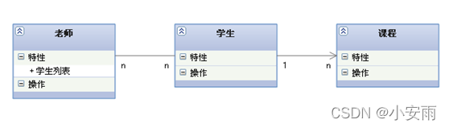

# UML笔记

1. 泛化 : 就是继承关系

2. 依赖 : 类与类的协作关系：一个类作为另一个类中某个方法的参数或者返回值类型出现。

3. 实现 : 实现接口。例如比大小的类都是实现了IComparable

4. 关联 : 整体与部分的关系，一个类作为另一个类的成员变量。

类之间的关系有：

泛化（继承）、实现、关联、聚合、组合、依赖。

1. 泛化（Generalization）继承
2. 实现（Realization）继承
3. 关联（Association) 
4. 聚合（Aggregation）关联的加强
5. 组合(Composition) 关联的加强
6. 依赖(Dependency)

各种关系的强弱顺序：

泛化 = 实现 > 组合 > 聚合 > 关联 > 依赖

# 1. 泛化 (Generalization)

[泛化关系] : 是一种继承关系, 表示一般与特殊的关系, 它指定了子类如何特化父类的所有特征和行为.

 例如 : 老虎是动物的一种, 即有老虎的特性也有动物的共性

>```c++
>class Animal{
>}
>
>class Tiger : pulibc Animal{ //继承Animal类
>}
>```

[箭头指向] : 带三角箭头的实线 , 箭头指向父类

 

# 2. 实现(Realization)

* [实现关系] : 是一种类与接口的关系, 表示类是接口所有特征和行为的实现

>```c++
>public IBrush {
>//    C++声明一个接口只能用带有纯虚函数的类去实现
>    virtual void func() = 0;//带纯虚函数类不能被实例化
>}
>class PenBrush: public IBrush {
>//    实现接口IBrush
>    void func() override{
>
>    }
>}
>```

* [箭头指向] : 带三角箭头的虚线 , 箭头指向接口

 

# 3. 关联(Association)

* [关联关系] : 是一种拥有的关系, 它使一个类知道另一个类的属性和方法;
  * 如:老师与学生，丈夫与妻子关联可以是双向的 , 也可以是单向的。双向的关联可以有两个箭头或者没有箭头,单向的关联有一个箭头。

* [代码体现] : 成员变量

>```c++
>#include <List>
>class Course;
>class Student;
>
>class Teacher{
>//老师不会只有一个学生，得有多个。
>    List<Student> student;
>}
>
>class Student {
>//学生不会只有一个老师，得有多个。
>    List<Teacher> teacher;
>//学生不会只有一门课程，得有多个。
>    List<Course> course;
>}
>
>class Course{
>}
>
>```

* [箭头及指向] : 带普通箭头的实心线 , 指向被拥有者

下图中 , 老师与学生是双向关联 , 老师有多名学生 , 学生也可能有多名老师。

但学生与某课程间的关系为单向关联 , 一名学生可能要上多门课程 , 课程是个抽象的东西他不拥有学生。

 

# 4. 聚合 (Aggregation)

[聚合关系] : 是整体与部分的关系, 且部分可以离开整体而单独存在。 如车和轮胎是整体和部分的关系, 轮胎离开车仍然可以存在

聚1合关系是关联关系的一种 , 是强的关联关系; 关联和聚合在语法上无法区分 , 必须考察具体的逻辑关系。

[代码体现] : 成员变量。